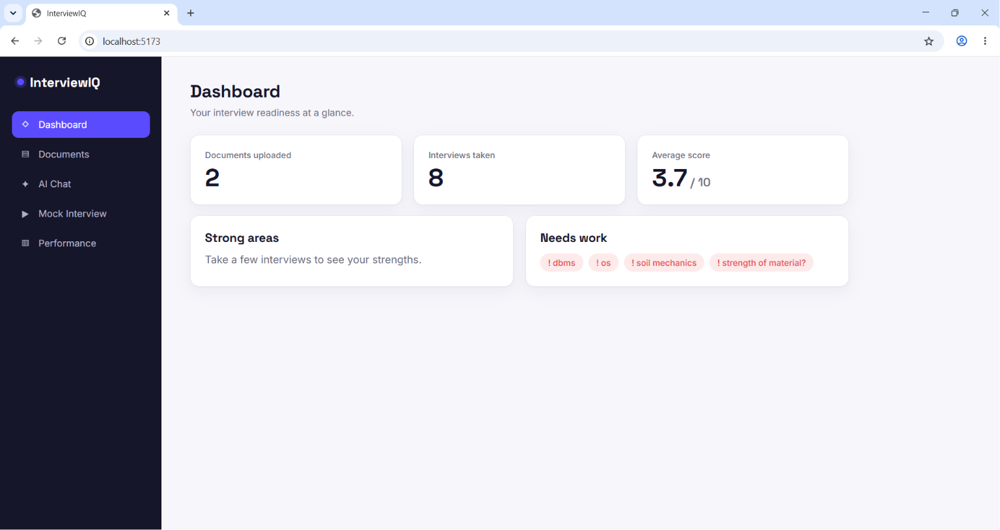
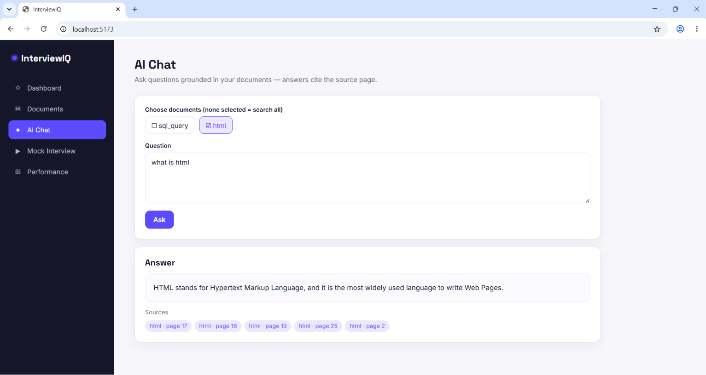
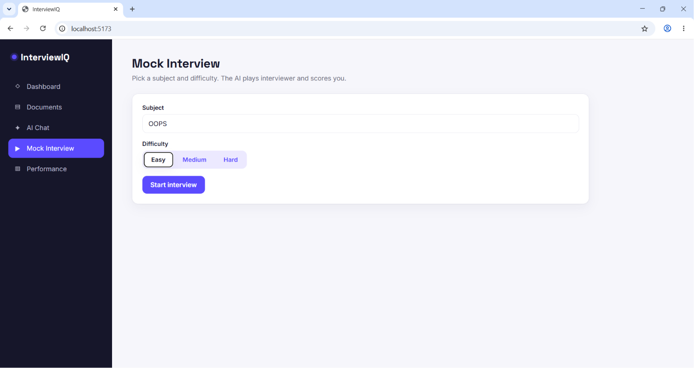
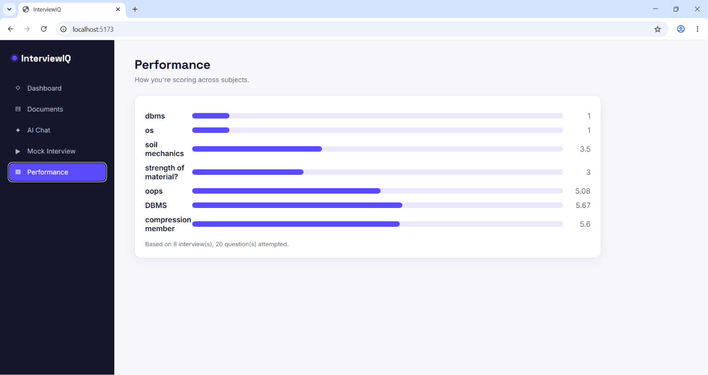

# InterviewIQ 🎯

An AI-powered placement preparation platform. Upload your study material, ask questions and get answers grounded in *your* notes with page-level citations, then take AI mock interviews that score your answers and track your readiness over time.

Built with a Retrieval-Augmented Generation (RAG) pipeline and Google Gemini.

---

## ✨ Features

- **📄 Document Q&A (RAG)** — Upload PDF notes and ask questions. Answers are grounded only in your documents, with citations back to the exact **source file and page number** (like NotebookLM).
- **🎤 AI Mock Interviews** — Pick a subject and difficulty. The AI plays interviewer, asks questions one by one, and scores each answer.
- **📊 AI Evaluation** — Every answer gets a score out of 10, a breakdown of what you got right, what you missed, and a model answer to learn from.
- **📈 Performance Tracking** — A live dashboard and per-subject performance view, built from your real interview history.
- **🔍 Multi-document search** — Search across one, several, or all of your uploaded documents at once.

---

## 🖼️ Screenshots


| Dashboard | AI Chat with citations |
|-----------|------------------------|
|  |  |

| Mock Interview | Evaluation |
|----------------|------------|
|  |  |

---

## 🏗️ How it works

```
PDF upload
   │
   ▼
Extract text page-by-page  ──►  Clean + chunk (preserving page numbers)
   │
   ▼
Embed chunks (all-MiniLM-L6-v2)  ──►  Store in FAISS (cosine similarity)
   │
   ▼
Question  ──►  Retrieve top-k relevant chunks  ──►  Gemini answers from context
   │
   ▼
Answer + citations (source file + page)
```

The same retrieval foundation powers the mock interview flow, where Gemini generates
questions and evaluates answers, with every result saved to the database.

---

## 🛠️ Tech Stack

**Backend**
- FastAPI (REST API)
- Google Gemini (`gemini-2.5-flash-lite`) — question generation, answering, evaluation
- sentence-transformers (`all-MiniLM-L6-v2`) — local embeddings, no API cost
- FAISS — vector similarity search
- SQLAlchemy + SQLite — documents, interviews, scores
- PyPDF + LangChain text splitter — PDF processing

**Frontend**
- React + Vite
- Plain CSS (custom design system)

---

## 📂 Project Structure

```
InterviewIQ/
├── backend/
│   ├── app.py              # FastAPI routes
│   ├── config.py           # paths + config
│   ├── database.py         # SQLAlchemy models + DB setup
│   ├── models.py           # Pydantic schemas
│   ├── pdf_processor.py    # extract + clean + chunk PDFs
│   ├── embeddings.py       # embedding model
│   ├── vector_store.py     # FAISS index
│   ├── retriever.py        # similarity search + filtering
│   ├── llm.py              # Gemini calls
│   ├── prompts.py          # prompt templates
│   ├── pipeline.py         # PDF → index pipeline
│   └── requirements.txt
└── frontend/
    ├── src/
    │   ├── pages/          # Dashboard, Documents, Chat, Interview, Performance
    │   ├── api.js          # backend API calls
    │   └── App.jsx
    └── package.json
```

---

## 🚀 Getting Started

### Prerequisites
- Python 3.10+
- Node.js 18+
- A free Google Gemini API key from [Google AI Studio](https://aistudio.google.com/)

### 1. Backend

```bash
cd backend
python -m venv venv
venv\Scripts\activate        # Windows
# source venv/bin/activate   # macOS / Linux

pip install -r requirements.txt
```

Create a `.env` file inside `backend/` (see `.env.example`):

```
GEMINI_API_KEY=your_api_key_here
```

Run the server:

```bash
uvicorn app:app --reload
```

Backend runs at `http://127.0.0.1:8000` — interactive API docs at `http://127.0.0.1:8000/docs`.

### 2. Frontend

In a **new terminal**:

```bash
cd frontend
npm install
npm run dev
```

Frontend runs at `http://localhost:5173`. Keep the backend running at the same time.

---

## 📡 API Endpoints

| Method | Endpoint | Description |
|--------|----------|-------------|
| `POST` | `/upload-pdf` | Upload and index a single PDF |
| `POST` | `/upload-multiple` | Upload and index several PDFs |
| `GET`  | `/documents` | List indexed documents |
| `POST` | `/ask` | Ask a question, get an answer with citations |
| `POST` | `/interview/start` | Start a mock interview |
| `POST` | `/interview/answer` | Submit an answer, get scored, get next question |
| `GET`  | `/interview/{id}` | Full interview transcript |
| `GET`  | `/dashboard` | Document count, interviews taken, average score |
| `GET`  | `/performance` | Per-subject performance breakdown |

---

## 🗺️ Roadmap

- [ ] User accounts (signup / login, per-user data)
- [ ] Resume analyzer — generate questions from a candidate's resume
- [ ] JD matching — match a resume against a job description
- [ ] HR / behavioural interview mode
- [ ] Voice interviews (speech-to-text)
- [ ] Streaming responses and chat history

---

## 👤 Author

**Dikshit Rao** — CSE, MNIT Jaipur

---

*Built as a hands-on exploration of RAG and LLM-powered applications.*
